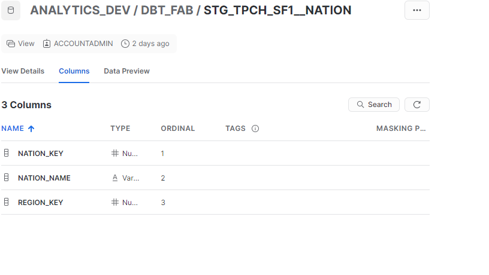

# Modern Data Stack Project

## O objetivo desse projeto é criar um pipeline completo, utilizando ferramentas atuais de mercado como Snowflake, DBT e PowerBI.

### Requirements:

O pipeline foi desenvolvido utilizando plataformas cloud, sendo assim é necessario contas de acesso nos seguintes ambiente:

- Snowflake
- DBT

Além disso é necessário um desktop com acesso ao snowflake configurado. para acesso da plataforma PowerBI Desktop

### WAREHOUSE:

#### View's de origem:
   ##### STG_TPCH_SF1__CUSTOMER

   ##### STG_TPCH_SF1__NATION

   ##### STG_TPCH_SF1__REGION

##### Tabela dimensão para load

   ##### DIM_CUSTOMER

### Transformação:
 
     dim_customer.sql

    
    Logs:

### Usando PowerBI e Snowflake para visualização dos dados

   ### Adicionando a conexão

   ### Transformando os dados e modelando o dashboard

